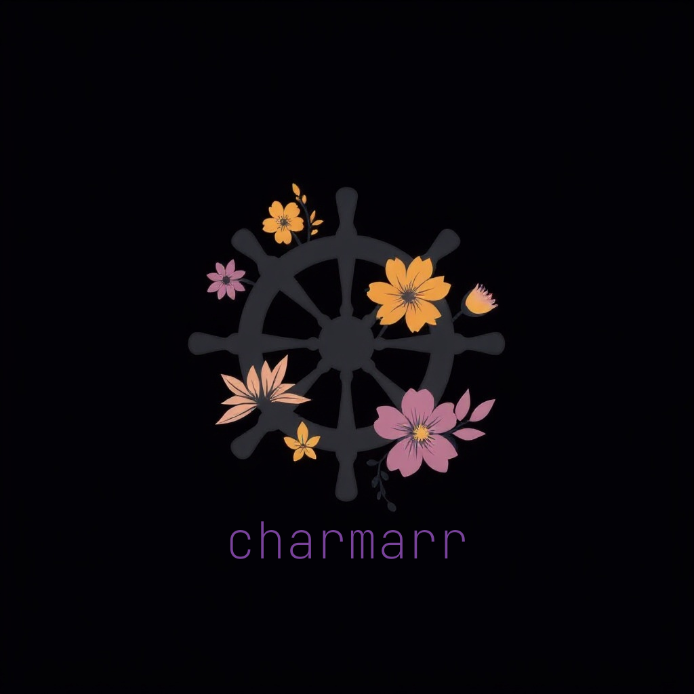

<p align="center">
  
</p>

<h1 align="center">Charmarr Charms</h1>

<p align="center">
  <a href="https://github.com/charmarr/charmarr/actions/workflows/ci.yaml"></a>
  <a href="https://github.com/astral-sh/uv"></a>
  <a href="https://github.com/charmarr/charmarr/blob/main/LICENSE"></a>
</p>

## Charms

| Charm | Description | CharmHub |
|-------|-------------|----------|
| **charmarr-storage-k8s** | Shared PVC provider for hardlinks across media apps | [](https://charmhub.io/charmarr-storage-k8s) |
| **charmarr-multimeter-k8s** | Test utility charm for validating interface providers | [](https://charmhub.io/charmarr-multimeter-k8s) |
| **gluetun-k8s** | VPN gateway with pod-gateway for routing client traffic | [](https://charmhub.io/gluetun-k8s) |

## Development

```bash
cd charms/charmarr-storage-k8s
uv venv && source .venv/bin/activate
uv sync
tox
```

<!-- TODO: expand this README -->

## License

AGPL-3.0-or-later
