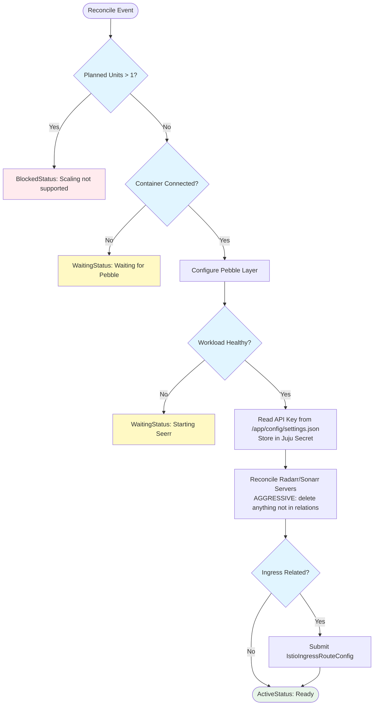

# Seerr Charm Implementation

## Context and Problem Statement

Overseerr has been deprecated following its merger with Jellyseerr into a new project called Seerr. Charmarr needs a `seerr-k8s` charm to replace `overseerr-k8s`, plus a migration path for existing deployments.

**Track context:**
- `seerr-k8s` is track-2 work (latest/edge) — breaking changes allowed
- `overseerr-k8s` is feature-locked — no track-2 release planned. The `export-config` action is the only addition, shipped on `latest` and backported to track-1. Must be backwards compatible.

**Key constraints:**
- Seerr uses the same `/api/v1/` endpoints as Overseerr — reconciliation logic carries over
- Seerr supports Plex, Jellyfin, and Emby (Overseerr was Plex-only)
- Seerr auto-migrates Overseerr config on first start if placed in the config directory
- Migration must be explicit and user-driven — not automatic

## Considered Options

### OCI Image Source
* **Option 1:** LinuxServer.io image — they deprecated Overseerr and [will not publish Seerr](https://github.com/linuxserver/docker-overseerr/issues/56)
* **Option 2:** Official `ghcr.io/seerr-team/seerr` — already rootless, no s6-overlay, UID 1000 native

### Migration Mechanism
* **Option 1:** `seerr-migrate` relation — Seerr reads config from Overseerr unit directly
* **Option 2:** Juju actions — `export-config` on overseerr-k8s, `import-config` on seerr-k8s via Juju secrets

### Media Server Interface
* **Option 1:** Add `media-server` relation now — Seerr supports Jellyfin/Emby which don't have plex.tv auto-discovery
* **Option 2:** No interface — revisit when Jellyfin/Emby charms are added to Charmarr

## Decision Outcome

**OCI Image Source: Option 2** — Official GHCR image. Already rootless with UID 1000, no s6-overlay to bypass. ADR-015 Pebble pattern still applies (run node directly). Config path is `/app/config` instead of `/config`.

**Migration Mechanism: Option 2** — Juju actions. Explicit, user-driven, safe for destructive operations. No relation-based migration — actions give the operator full control over timing.

**Media Server Interface: Option 2** — No interface for now. Seerr uses Plex OAuth auto-discovery (same as Overseerr). Whether to add a `media-server` relation is undecided — it depends on if/when Jellyfin or Emby charms are added to Charmarr.

## Implementation Details

### OCI Image

Official image from `ghcr.io/seerr-team/seerr`:
- Rootless, runs as UID 1000 natively — user already exists in the image
- No s6-overlay — run `node /app/dist/index.js` directly via Pebble
- Config path: `/app/config` (not `/config`)
- Port: 5055 (same as Overseerr)
- No `PUID`/`PGID` environment variables (irrelevant — we use Pebble's `user-id`/`group-id`)

Unlike LinuxServer.io images, `ensure_pebble_user()` is **not needed** — the official image ships with UID 1000 already in `/etc/passwd`. This simplifies the charm compared to Overseerr.

### Process User/Group

Like Overseerr, Seerr has no storage relation (doesn't touch media files — purely an API orchestrator). Per [ADR-015](adr-015-pebble-linuxserver-pattern.md), apps without storage relations use hardcoded 1000:1000:

| Aspect | Overseerr (LinuxServer) | Seerr (Official GHCR) |
|--------|------------------------|----------------------|
| PUID/PGID | Hardcoded 1000:1000 in `_constants.py` | Hardcoded 1000:1000 in `_constants.py` |
| `ensure_pebble_user()` | Required (LSCR images lack passwd entries) | Not needed (UID 1000 exists in image) |
| `chown` config dir | Required | Required (`/app/config` instead of `/config`) |
| Storage relation | None | None |

### API Compatibility

Seerr maintains full `/api/v1/` compatibility with Overseerr:
- Same Radarr/Sonarr server management endpoints (`/api/v1/settings/radarr`, `/api/v1/settings/sonarr`)
- Same `settings.json` structure with `main.apiKey`
- No breaking API changes — existing reconciliation logic from ADR-010 carries over as-is

### Media Server Support

| Feature | Overseerr | Seerr |
|---------|-----------|-------|
| Plex | ✓ (OAuth auto-discovery) | ✓ (OAuth auto-discovery) |
| Jellyfin | ✗ | ✓ |
| Emby | ✗ | ✓ |

Jellyfin/Emby setup in Seerr requires manual URL entry in the wizard. Whether to automate this via a `media-server` relation is undecided — can be revisited when Jellyfin or Emby charms are added to Charmarr.

### Migration Mechanism (Action-Based)

Seerr auto-migrates Overseerr config on first start. The charm needs to transfer `settings.json` and the SQLite database from overseerr to seerr.

**Approach:** Juju actions with Juju secrets as the transport layer.

1. `overseerr-k8s` gets an `export-config` action — tars the config directory, stores as a Juju secret
2. `seerr-k8s` gets an `import-config` action — reads the secret, extracts to `/app/config`
3. Seerr auto-migrates on next start

**Migration flow:**
```bash
juju run overseerr/0 export-config          # exports config to Juju secret
juju deploy seerr-k8s seerr                  # deploy fresh seerr
juju run seerr/0 import-config source=overseerr  # import config
# Seerr auto-migrates on restart
juju remove-application overseerr            # decommission when ready
```

No `seerr-migrate` relation needed — actions are safer for one-time destructive operations. The operator controls timing, can inspect results, and can roll back by simply not decommissioning Overseerr.

**overseerr-k8s update:** Add `export-config` action only. This is additive (new action, no existing behaviour changes) so it is backwards compatible and safe to backport to track-1.

### RequestManager Enum

Add `SEERR = "seerr"` to `RequestManager` in charmarr-lib. `MediaManagerRequirerData.requester` uses `RequestManager.SEERR` for Seerr.

### Reconciler Flow

Identical to Overseerr (see [ADR-010](adr-010-overseer.md)) with config path change:



### Pebble Layer

```python
def _build_pebble_layer(self) -> ops.pebble.LayerDict:
    """Build Pebble layer — run Seerr node process directly."""
    return {
        "services": {
            "workload": {
                "override": "replace",
                "command": "node /app/dist/index.js",
                "startup": "enabled",
                "user-id": DEFAULT_PUID,
                "group-id": DEFAULT_PGID,
                "environment": {
                    "LOG_LEVEL": self.config["log-level"],
                    "TZ": "Etc/UTC",
                },
            }
        },
        "checks": {
            "workload-ready": {
                "override": "replace",
                "level": "ready",
                "http": {"url": "http://localhost:5055/api/v1/status"},
            }
        },
    }
```

## charmcraft.yaml

```yaml
name: seerr-k8s
type: charm
title: Seerr
summary: Content request management for Plex, Jellyfin, and Emby
description: |
  Seerr is a request management and media discovery tool for Plex,
  Jellyfin, and Emby. Successor to Overseerr and Jellyseerr.

  This charm provides:
  - Automatic Radarr/Sonarr configuration via relations
  - Ingress integration for external access
  - Migration from overseerr-k8s via Juju actions

  After deployment:
  1. Access Seerr UI via ingress or port-forward
  2. Complete media server setup (Plex OAuth / Jellyfin URL / Emby URL)
  3. Select libraries to sync
  4. Radarr/Sonarr already configured via relations

  Migration from overseerr-k8s:
  1. juju run overseerr/0 export-config
  2. juju deploy seerr-k8s seerr
  3. juju run seerr/0 import-config source=overseerr
  4. juju remove-application overseerr

links:
  documentation: https://github.com/charmarr/seerr-k8s
  source: https://github.com/charmarr/seerr-k8s
  issues: https://github.com/charmarr/seerr-k8s/issues

assumes:
  - k8s-api
  - juju >= 3.6

platforms:
  amd64:
    - name: ubuntu
      channel: "24.04"

charm-libs:
  - lib: charms.istio_ingress_k8s.v0.istio_ingress_route

parts:
  charm:
    source: .
    plugin: uv
    build-packages: [git]
    build-snaps: [astral-uv]

containers:
  seerr:
    resource: seerr-image

resources:
  seerr-image:
    type: oci-image
    description: OCI image for Seerr
    upstream-source: ghcr.io/seerr-team/seerr:latest

storage:
  config:
    type: filesystem
    location: /app/config
    minimum-size: 1G

requires:
  media-manager:
    interface: media-manager
  ingress:
    interface: istio_ingress_route
    limit: 1
    optional: true

config:
  options:
    log-level:
      type: string
      default: "info"
      description: |
        Application log level.
        One of: debug, info, warn, error

actions:
  rotate-api-key:
    description: |
      Rotate Seerr API key.
      Regenerates the key in Seerr and updates the Juju secret.
      External integrations using the old key will need to be updated manually.
  import-config:
    description: |
      Import configuration from an overseerr-k8s deployment.
      Reads the exported config from a Juju secret and extracts it to /app/config.
      Seerr will auto-migrate Overseerr config on next start.
    params:
      source:
        type: string
        description: Name of the overseerr application that exported the config.
    required:
      - source
```

## User Experience

### Fresh Deployment

```bash
juju deploy seerr-k8s seerr
juju relate seerr radarr
juju relate seerr sonarr
juju relate seerr istio-ingress
```

### Migration from Overseerr

```bash
# Export from existing overseerr
juju run overseerr/0 export-config

# Deploy seerr
juju deploy seerr-k8s seerr

# Import and migrate
juju run seerr/0 import-config source=overseerr

# Re-establish relations
juju relate seerr radarr
juju relate seerr sonarr
juju relate seerr istio-ingress

# Decommission when satisfied
juju remove-application overseerr
```

### What's Automated vs Manual

| Task | Automated | Manual |
|------|-----------|--------|
| Radarr/Sonarr servers | ✓ via relations | |
| Quality profiles | ✓ from relation data | |
| Root folders | ✓ from relation data | |
| Default server per tier | ✓ first related | |
| Media server setup | | ✓ Plex OAuth / Jellyfin URL / Emby URL |
| Library sync | | ✓ user selects libraries |
| User permissions | | ✓ admin configures |
| Migration from Overseerr | | ✓ via Juju actions |

## Consequences

### Good

- **Clean migration path** — Action-based, user-controlled, reversible (don't decommission until satisfied)
- **Expanded media server support** — Plex + Jellyfin + Emby (vs Plex-only Overseerr)
- **Official image** — No LinuxServer.io dependency; already rootless, UID 1000 native (no `ensure_pebble_user()` needed)
- **API compatible** — Reconciliation logic is unchanged from Overseerr
- **Simple charm** — Same single functional interface (`media-manager`) as Overseerr
- **Backwards-compatible migration** — `export-config` action on overseerr-k8s is purely additive, safe to backport to track-1

### Bad

- **New image source** — GHCR instead of LSCR; different update/monitoring patterns
- **Manual servers get deleted** — Same aggressive reconciliation as Overseerr
- **Manual setup still required** — Media server configuration cannot be fully automated

### Neutral

- **API is compatible** — Reconciliation logic is copy-paste from Overseerr charm
- **`media-server` interface undecided** — Can be revisited when Jellyfin/Emby charms are added to Charmarr

## Related ADRs

- [apps/adr-010](adr-010-overseer.md) — Overseerr charm (predecessor)
- [apps/adr-015](adr-015-pebble-linuxserver-pattern.md) — Pebble/LinuxServer pattern (applies to Seerr even though it's not LinuxServer)
- [apps/adr-012](adr-012-app-scaling-v1.md) — Single-instance scaling constraints
- [interfaces/adr-006](../interfaces/adr-006-media-manager.md) — media-manager interface
