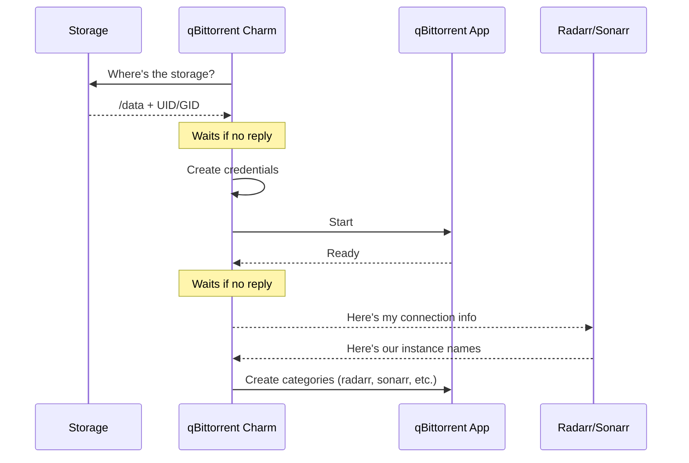

# Download Client

## qBittorrent

The qBittorrent charm (`qbittorrent-k8s`) manages qBittorrent in your Charmarr stack. qBittorrent is a torrent client that downloads files via BitTorrent.

### Relations

The charm talks to other charms to figure out how to set everything up. The order in which these connections happen doesn't matter. The charm sorts it out.

| Connects To | What It Learns |
|-------------|----------------|
| **Storage** | Where to save downloads (`/data`), UID/GID for file permissions |
| **Radarr/Sonarr** | Which media managers need download categories |
| **VPN Gateway** | VPN routing |
| **Ingress** | Enables external access |

The charm creates download categories automatically based on connected media managers. For example, if you have `radarr` and `sonarr-4k` connected, qBittorrent gets categories named `radarr` and `sonarr-4k` with appropriate save paths.

Credentials are generated automatically and stored as Juju secrets. They [rotate periodically](../security/secrets.md) if configured.

### Lifecycle

### Configuration

See [qbittorrent-k8s on Charmhub](https://charmhub.io/qbittorrent-k8s) for all options.

---

## SABnzbd

The SABnzbd charm (`sabnzbd-k8s`) manages SABnzbd in your Charmarr stack. SABnzbd is a usenet client that downloads files via Usenet (NZB).

### Relations

The charm talks to other charms to figure out how to set everything up. The order in which these connections happen doesn't matter. The charm sorts it out.

| Connects To | What It Learns |
|-------------|----------------|
| **Storage** | Where to save downloads (`/data`), UID/GID for file permissions |
| **Radarr/Sonarr** | Which media managers need download categories |
| **VPN Gateway** | VPN routing |
| **Ingress** | Enables external access |

Like qBittorrent, SABnzbd gets categories automatically based on connected media managers.

An API key is generated automatically and stored as a Juju secret. It [rotates periodically](../security/secrets.md) if configured.

### Lifecycle

### Configuration

See [sabnzbd-k8s on Charmhub](https://charmhub.io/sabnzbd-k8s) for all options.
