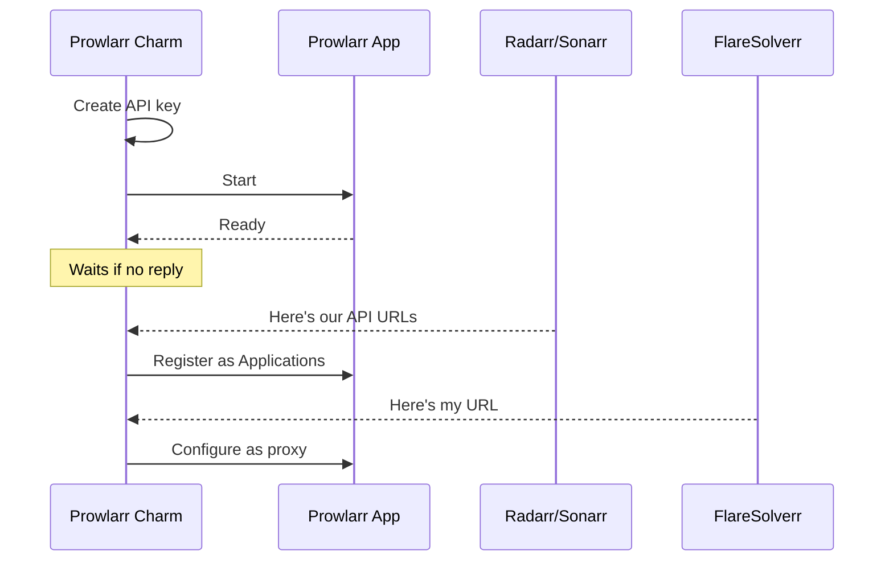
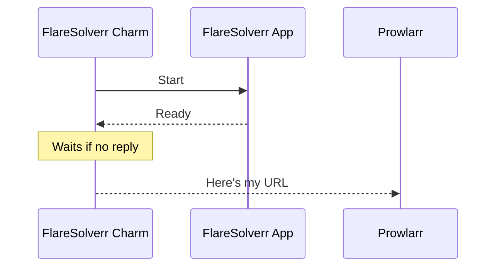

# Media Indexer

## Prowlarr

The Prowlarr charm (`prowlarr-k8s`) manages Prowlarr in your Charmarr stack. Prowlarr is the central indexer manager that syncs indexers to your media managers (Radarr/Sonarr).

### Relations

The charm talks to other charms to figure out how to set everything up. The order in which these connections happen doesn't matter. The charm sorts it out.

| Connects To | What It Learns |
|-------------|----------------|
| **Radarr/Sonarr** | Gets their API URLs, registers them as "Applications" in Prowlarr |
| **FlareSolverr** | Gets its URL, configures it as a proxy for Cloudflare-protected indexers |
| **VPN Gateway** | VPN routing |
| **Ingress** | Enables external access |

Unlike Radarr/Sonarr, Prowlarr doesn't need storage or download client relations. It only manages indexers.

The charm aggressively reconciles applications. If you manually add an application in Prowlarr that isn't a Juju relation, it gets deleted. Charms are declarative and Charmarr is designed to ✨just work✨.

An API key is generated automatically and stored as a Juju secret. It [rotates periodically](../security/secrets.md) if configured.

### How It Works

Prowlarr's job is to register your arr apps as "Applications". Once registered, Prowlarr automatically syncs all your indexers to them. The charm doesn't trigger sync operations. It just registers apps and sets `syncLevel: fullSync`, letting Prowlarr handle the rest.

Users add indexers via the Prowlarr UI. The charm handles everything else.

### Lifecycle

### Configuration

See [prowlarr-k8s on Charmhub](https://charmhub.io/prowlarr-k8s) for all options.

---

## FlareSolverr

The FlareSolverr charm (`flaresolverr-k8s`) manages FlareSolverr in your Charmarr stack. FlareSolverr is a Cloudflare bypass proxy that helps Prowlarr access indexers behind Cloudflare protection.

### Relations

| Connects To | What It Provides |
|-------------|------------------|
| **Prowlarr** | Its URL so Prowlarr can use it as a proxy |

### Lifecycle

FlareSolverr is simple. It starts, becomes ready, and tells Prowlarr where to find it. Prowlarr then configures it as an indexer proxy automatically.

### Configuration

See [flaresolverr-k8s on Charmhub](https://charmhub.io/flaresolverr-k8s) for all options.
