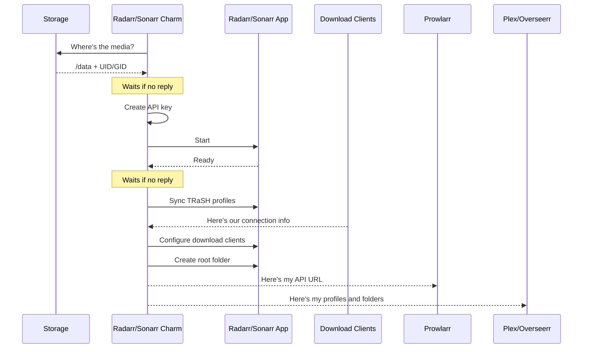

# Media Manager

## Radarr & Sonarr

The Radarr charm (`radarr-k8s`) and Sonarr charm (`sonarr-k8s`) manage [Radarr](https://radarr.video/) and [Sonarr](https://sonarr.tv/) in your Charmarr stack. Radarr handles movies, Sonarr handles TV shows. The charms share nearly identical logic, differing only in ports, media types, and folder paths.

### Relations

The charms talk to other charms to figure out how to set everything up. The order in which these connections happen doesn't matter. The charm sorts it out.

| Connects To | Interface | What It Learns |
|-------------|-----------|----------------|
| **Storage** | `media-storage` | Where the media root is, UID/GID for file permissions |
| **Prowlarr** | `media-indexer` | Publishes API URL so Prowlarr can push indexers |
| **qBittorrent/SABnzbd** | `download-client` | Gets their connection info, configures them as download clients |
| **Plex** | `media-manager` | Publishes root folders and content type so Plex can create libraries |
| **Overseerr** | `media-manager` | Publishes API URL, quality profiles, root folders so Overseerr can send requests |
| **VPN Gateway** | `vpn-gateway` | Optional VPN routing (if related) |
| **Ingress** | `istio_ingress_route` | Enables external access |

The charm aggressively reconciles download clients. If you manually add a download client in Radarr/Sonarr that isn't a Juju relation, it gets deleted. Charms are declarative and Charmarr is designed to ✨just work✨.

An API key is generated automatically and stored as a Juju secret. It [rotates periodically](../security/secrets.md) if configured.

### Lifecycle

### Variants

Deploy multiple instances with different variants to separate content:

| Variant | Radarr Root Folder | Sonarr Root Folder | Default TRaSH Profile |
|---------|--------------------|--------------------|----------------------|
| standard | `/data/media/movies` | `/data/media/tv` | None (set manually) |
| 4k | `/data/media/movies-uhd` | `/data/media/tv-uhd` | `uhd-bluray-web` |
| anime | `/data/media/anime/movies` | `/data/media/anime/tv` | `anime` |

Each variant uses its app name as the download client category (e.g., `radarr`, `radarr-4k`). The download clients create matching categories automatically.

Each Radarr/Sonarr charm includes a [Recyclarr](https://recyclarr.dev/) sidecar that syncs quality profiles from [TRaSH Guides](https://trash-guides.info/). Recyclarr runs on every reconcile if configured. It's idempotent, so running it multiple times is safe. The profiles it creates are published to Overseerr automatically.

!!! note
    Override default profiles using the `trash-profiles` config option. See [Manual Deploy](../setup/manual.md#media-managers).

### Configuration

See [radarr-k8s on Charmhub](https://charmhub.io/radarr-k8s) and [sonarr-k8s on Charmhub](https://charmhub.io/sonarr-k8s) for all options.
