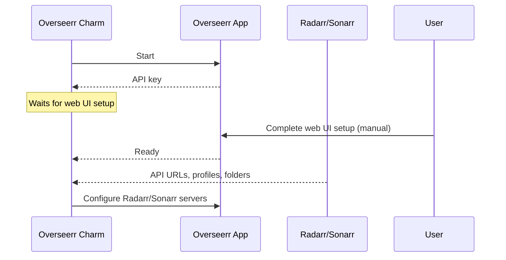

# Media Requester

## Overseerr

The Overseerr charm (`overseerr-k8s`) manages Overseerr in your Charmarr stack. Overseerr is where users request movies and TV shows.

### Relations

The charm talks to other charms to figure out how to set up Overseerr. The order in which these connections happen doesn't matter. The charm sorts it out.

| Connects To | What It Learns |
|-------------|----------------|
| **Radarr/Sonarr** | API URL, quality profiles, root folders. Configures them automatically in Overseerr. |
| **Plex** | Allows Overseerr to talk to Plex |
| **Ingress** | Enables external access to Overseerr |

The charm aggressively reconciles Radarr/Sonarr servers. If you manually add a server in Overseerr that isn't a Juju relation, it gets deleted. Charms are declarative and Charmarr is designed to ✨just work✨.

### Lifecycle

!!! note
    The web UI setup cannot be automated. The charm waits for the user to complete it before configuring Radarr/Sonarr. See [Post-Deploy](../setup/post-deploy.md#2-overseerr-setup) for details.

### Configuration

See [overseerr-k8s on Charmhub](https://charmhub.io/overseerr-k8s) for all options.
