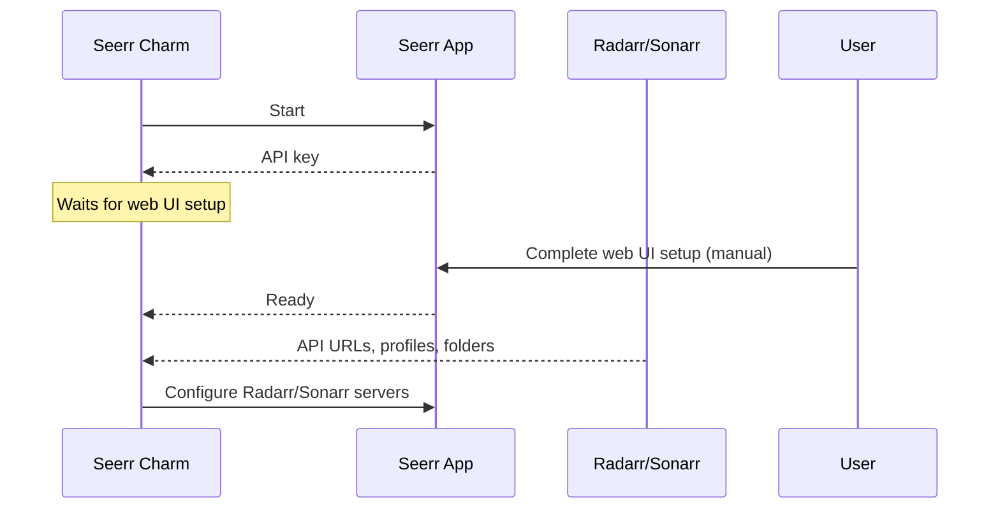
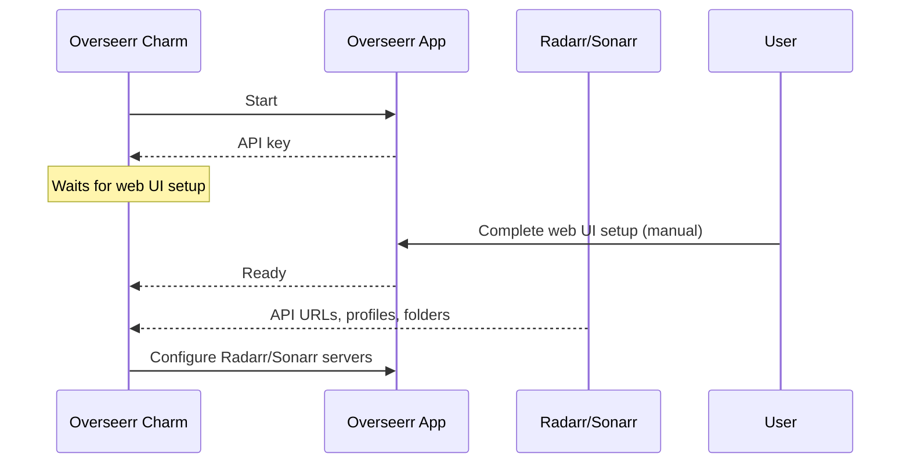

# Media Requester

## Seerr

The Seerr charm (`seerr-k8s`) manages [Seerr](https://seerr.dev/) in your Charmarr stack. Seerr is where users request movies and TV shows. It's the successor to Overseerr and Jellyseerr, maintained as a single unified project upstream.

### Relations

The charm talks to other charms to figure out how to set up Seerr. The order in which these connections happen doesn't matter — the charm sorts it out.

| Connects To | Interface | What It Learns |
|-------------|-----------|----------------|
| **Radarr/Sonarr** | `media-manager` | API URL, quality profiles, root folders. Configures them automatically in Seerr. |
| **Plex** | `media-server` | Allows Seerr to talk to Plex |
| **Ingress** | `istio_ingress_route` | Enables external access to Seerr |

The charm aggressively reconciles Radarr/Sonarr servers. If you manually add a server in Seerr that isn't a Juju relation, it gets deleted. Charms are declarative and Charmarr is designed to ✨just work✨.

### Lifecycle

```mermaid
sequenceDiagram
    participant SC as Seerr Charm
    participant Seerr as Seerr App
    participant RC as Radarr/Sonarr
    participant User

    SC->>Seerr: Start
    Seerr-->>SC: API key
    Note over SC: Waits for web UI setup

    User->>Seerr: Complete web UI setup (manual)
    Seerr-->>SC: Ready

    RC-->>SC: API URLs, profiles, folders
    SC->>Seerr: Configure Radarr/Sonarr servers
```

!!! note
    The web UI setup cannot be automated. The charm waits for the user to complete it before configuring Radarr/Sonarr. See [Post-Deploy](../setup/post-deploy.md#2-seerr-setup) for details.

### Configuration

See [seerr-k8s on Charmhub](https://charmhub.io/seerr-k8s) for all options.

## Overseerr (deprecated)

!!! warning
    Upstream Overseerr has merged with Jellyseerr into Seerr. The
    `overseerr-k8s` charm is in maintenance mode and will be removed in
    a future release. New deployments should use Seerr above. To move an
    existing Overseerr deployment, see the
    [migration runbook](../migration/overseerr-to-seerr.md).

The Overseerr charm (`overseerr-k8s`) manages [Overseerr](https://overseerr.dev/) in your Charmarr stack. Overseerr is where users request movies and TV shows.

### Relations

The charm talks to other charms to figure out how to set up Overseerr. The order in which these connections happen doesn't matter. The charm sorts it out.

| Connects To | Interface | What It Learns |
|-------------|-----------|----------------|
| **Radarr/Sonarr** | `media-manager` | API URL, quality profiles, root folders. Configures them automatically in Overseerr. |
| **Plex** | `media-server` | Allows Overseerr to talk to Plex |
| **Ingress** | `istio_ingress_route` | Enables external access to Overseerr |

The charm aggressively reconciles Radarr/Sonarr servers. If you manually add a server in Overseerr that isn't a Juju relation, it gets deleted. Charms are declarative and Charmarr is designed to ✨just work✨.

### Lifecycle

```mermaid
sequenceDiagram
    participant OC as Overseerr Charm
    participant Overseerr as Overseerr App
    participant RC as Radarr/Sonarr
    participant User

    OC->>Overseerr: Start
    Overseerr-->>OC: API key
    Note over OC: Waits for web UI setup

    User->>Overseerr: Complete web UI setup (manual)
    Overseerr-->>OC: Ready

    RC-->>OC: API URLs, profiles, folders
    OC->>Overseerr: Configure Radarr/Sonarr servers
```

!!! note
    The web UI setup cannot be automated. The charm waits for the user to complete it before configuring Radarr/Sonarr. See the [track 1 post-deploy guide](https://charmarr.tv/en/track-1/setup/post-deploy/) for the Overseerr setup steps.

### Configuration

See [overseerr-k8s on Charmhub](https://charmhub.io/overseerr-k8s) for all options.
