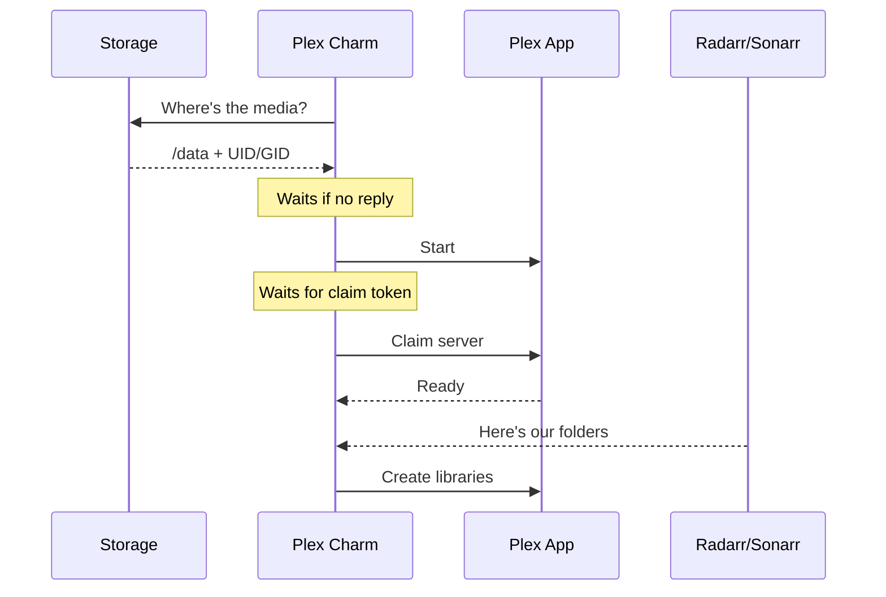

# Media Server

## Plex

The Plex charm (`plex-k8s`) manages [Plex](https://www.plex.tv/) Media Server in your Charmarr stack.

### Relations

The charm talks to other charms to figure out how to set up Plex. The order in which these connections happen doesn't matter. The charm sorts it out.

| Connects To | Interface | What It Learns |
|-------------|-----------|----------------|
| **Storage** | `media-storage` | Where the media root is (`/data`), UID/GID for file permissions |
| **Radarr/Sonarr** | `media-manager` | Where each app hardlinks its media and what content type (movies, tv, anime, 4k, etc.) |
| **Overseerr** | `media-server` | Allows Overseerr to talk to Plex |
| **Ingress** | `istio_ingress_route` | Enables external access to Plex |

From this information, the charm automatically creates Plex libraries that match your Radarr/Sonarr setup:

| App | Variant | Library Created |
|-----|---------|-----------------|
| Radarr | standard | Movies |
| Radarr | 4k | Movies (4K) |
| Radarr | anime | Anime Movies |
| Sonarr | standard | TV Shows |
| Sonarr | 4k | TV Shows (4K) |
| Sonarr | anime | Anime |

If you rename a library in Plex, the charm won't overwrite it. But this is not recommended. Charms are declarative and Charmarr is designed to ✨just work✨.

### Lifecycle

See [Post-Deploy](../setup/post-deploy.md#1-plex-setup) for claim token details.

### Configuration

See [plex-k8s on Charmhub](https://charmhub.io/plex-k8s) for all options.
