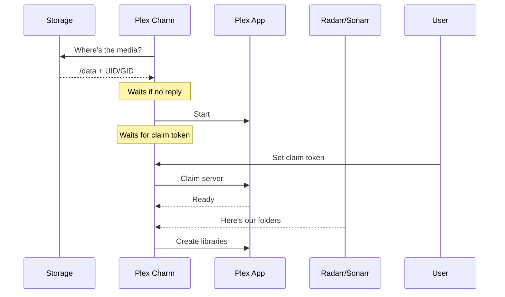
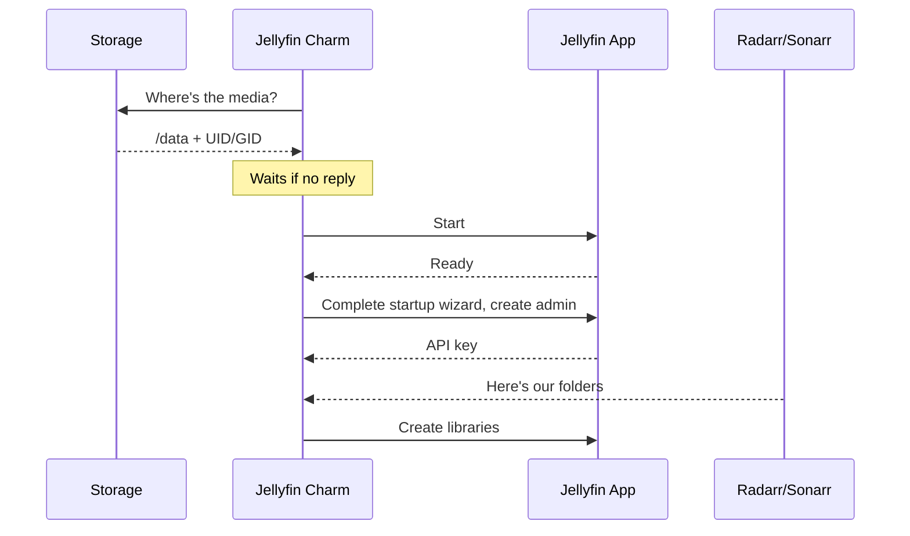

# Media Server

## Plex

The Plex charm (`plex-k8s`) manages [Plex](https://www.plex.tv/) Media Server in your Charmarr stack.

### Relations

The charm talks to other charms to figure out how to set up Plex. The order in which these connections happen doesn't matter. The charm sorts it out.

| Connects To | Interface | What It Learns |
|-------------|-----------|----------------|
| **Storage** | `media-storage` | Where the media root is (`/data`), UID/GID for file permissions |
| **Radarr/Sonarr** | `media-manager` | Where each app hardlinks its media and what content type (movies, tv, anime, 4k, etc.) |
| **Seerr** | `media-server` | Allows Seerr to talk to Plex |
| **Ingress** | `ingress` or `istio_ingress_route` | Enables external access to Plex |

From this information, the charm automatically creates Plex libraries that match your Radarr/Sonarr setup:

| App | Variant | Library Created |
|-----|---------|-----------------|
| Radarr | standard | Movies |
| Radarr | 4k | Movies (4K) |
| Radarr | anime | Anime Movies |
| Sonarr | standard | TV Shows |
| Sonarr | 4k | TV Shows (4K) |
| Sonarr | anime | Anime |

If you rename a library in Plex, the charm won't overwrite it. But this is not recommended. Charms are declarative and Charmarr is designed to ✨just work✨.

### Lifecycle


```mermaid
sequenceDiagram
    participant Storage
    participant PC as Plex Charm
    participant Plex as Plex App
    participant RC as Radarr/Sonarr
    participant User

    PC->>Storage: Where's the media?
    Storage-->>PC: /data + UID/GID
    Note over PC: Waits if no reply

    PC->>Plex: Start
    Note over PC: Waits for claim token
    User->>PC: Set claim token
    PC->>Plex: Claim server
    Plex-->>PC: Ready

    RC-->>PC: Here's our folders
    PC->>Plex: Create libraries
```

See [Post-Deploy](../setup/post-deploy.md#1-plex-setup) for claim token details.

### Configuration

See [plex-k8s on Charmhub](https://charmhub.io/plex-k8s) for all options.

---

## Jellyfin

The Jellyfin charm (`jellyfin-k8s`) manages [Jellyfin](https://jellyfin.org/) in your Charmarr stack. It is an alternative to Plex, not an addition: pick one or run both side by side, each behind its own ingress.

### Relations

The charm talks to other charms to figure out how to set up Jellyfin. The order in which these connections happen doesn't matter. The charm sorts it out.

| Connects To | Interface | What It Learns |
|-------------|-----------|----------------|
| **Storage** | `media-storage` | Where the media root is (`/data`), UID/GID for file permissions |
| **Radarr/Sonarr** | `media-manager` | Where each app hardlinks its media and what content type (movies, tv, anime, 4k, etc.) |
| **Seerr** | `media-server` | Allows Seerr to talk to Jellyfin |
| **Ingress** | `ingress` or `istio_ingress_route` | Enables external access to Jellyfin |

Libraries are created from the same mapping Plex uses:

| App | Variant | Library Created |
|-----|---------|-----------------|
| Radarr | standard | Movies |
| Radarr | 4k | Movies (4K) |
| Radarr | anime | Anime Movies |
| Sonarr | standard | TV Shows |
| Sonarr | 4k | TV Shows (4K) |
| Sonarr | anime | Anime |

### Lifecycle

Unlike Plex, Jellyfin needs no claim token and no manual web UI setup. The charm drives the startup wizard itself, creates the administrator account, and stores it as a Juju secret.


```mermaid
sequenceDiagram
    participant Storage
    participant JC as Jellyfin Charm
    participant JF as Jellyfin App
    participant RC as Radarr/Sonarr

    JC->>Storage: Where's the media?
    Storage-->>JC: /data + UID/GID
    Note over JC: Waits if no reply

    JC->>JF: Start
    JF-->>JC: Ready
    JC->>JF: Complete startup wizard, create admin
    JF-->>JC: API key

    RC-->>JC: Here's our folders
    JC->>JF: Create libraries
```

Retrieve the initial admin credentials with:

```bash
juju show-secret --reveal admin-credentials
```

These are a first-login handover, not a live mirror of the account. Rename the account or change its password in the Jellyfin UI whenever you like: the charm authenticates with an API key minted during the wizard, which is independent of the account's username and password. Even key rotation uses the current key to authorise its replacement, so it never needs the password back. The secret keeps the original value, so note your new password somewhere.

The one thing the password is still needed for is Seerr's first-run bootstrap, which signs in to Jellyfin with these credentials. If you change the password before relating Seerr, that bootstrap fails. Relate Seerr first, or leave the generated password alone until you have.

### Configuration

See [jellyfin-k8s on Charmhub](https://charmhub.io/jellyfin-k8s) for all options.
