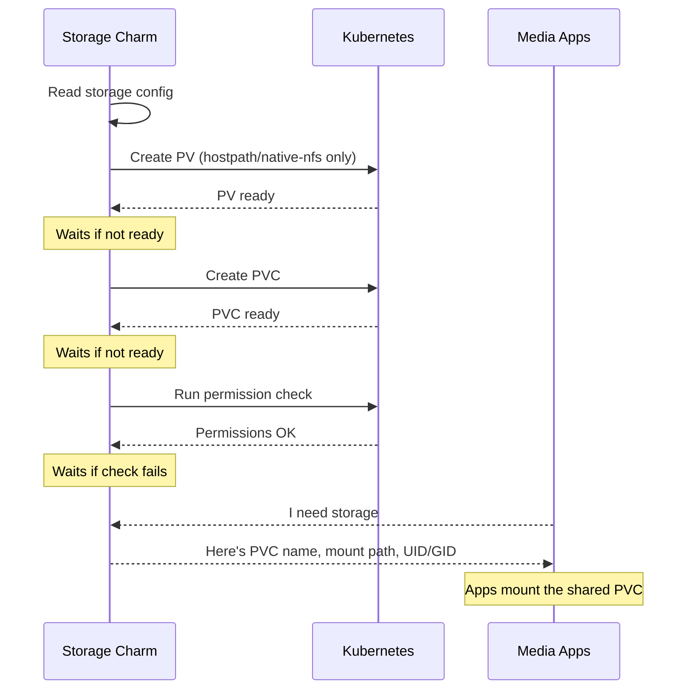

# Storage

## Charmarr Storage

The Charmarr Storage charm (`charmarr-storage-k8s`) manages the shared storage in your Charmarr stack. All media apps mount the same storage volume, which enables hardlinks between download clients and media managers.

### Why Shared Storage Matters

When qBittorrent finishes downloading a file, Radarr or Sonarr moves it to your media library. Without shared storage, this is a copy operation (slow, uses double disk space). With shared storage, it's a hardlink (instant, no extra space).

Hardlinks are also atomic, which lets Charmarr follow [TRaSH Guides](https://trash-guides.info/) recommendations for instant media imports.

The storage charm creates the necessary Kubernetes storage resources (PV and PVC for hostpath/native-nfs, or just PVC for storage-class) that all apps mount at `/data`. This is what makes hardlinks possible.

### Relations

| Connects To | What It Provides |
|-------------|------------------|
| **Radarr/Sonarr** | PVC name, mount path, UID/GID for file permissions |
| **qBittorrent/SABnzbd** | PVC name, mount path, UID/GID for file permissions |
| **Plex** | PVC name, mount path, UID/GID for file permissions |

The charm publishes PUID/PGID (user/group IDs) to all connected apps. This ensures every app writes files with the same ownership, which is required for hardlinks to work.

### Backend Types

The charm supports three storage backends:

| Backend | Use Case |
|---------|----------|
| **hostpath** | Mount a directory from the host node. The charm creates a PV and PVC. Recommended for single-node clusters. |
| **native-nfs** | Connect directly to an NFS server. The charm creates a PV and PVC. Do not run on the same node as the NFS server (loopback causes deadlock). |
| **storage-class** | Use an existing Kubernetes StorageClass. Experimental. |

### Lifecycle

### Configuration

The charm requires:

- **Backend type** (storage-class, native-nfs, or hostpath)
- **Backend-specific config** (storage class name, NFS server/path, or host path)
- **PUID/PGID** for file ownership (defaults to 1000:1000)

!!! important "Size configuration"
    For hostpath and native-nfs, the `size` config is purely informational. Actual capacity depends on the space available in the path itself. For storage-class, this depends entirely on the CSI driver and needs to be configured carefully at your discretion to prevent data loss.

!!! warning "Cleanup on remove"
    The `cleanup-on-remove` config deletes the PVC when the charm is removed. For hostpath and native-nfs, `true` is safely recommended. For storage-class, configure carefully at your discretion as behavior depends on the CSI driver's reclaim policy.

See [charmarr-storage-k8s on Charmhub](https://charmhub.io/charmarr-storage-k8s) for all options.
