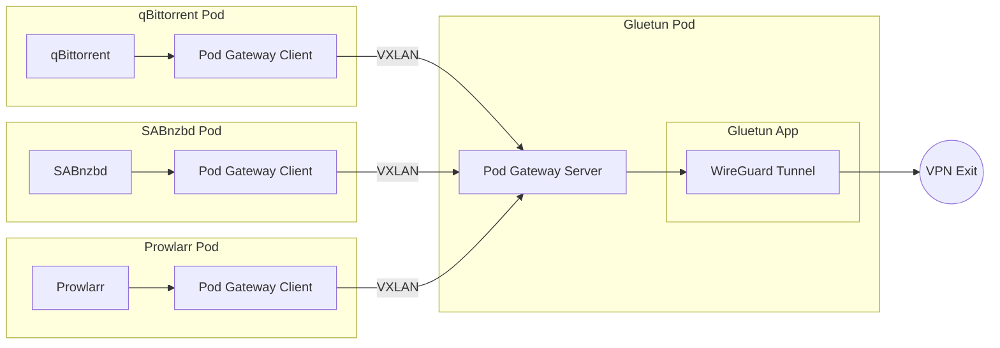
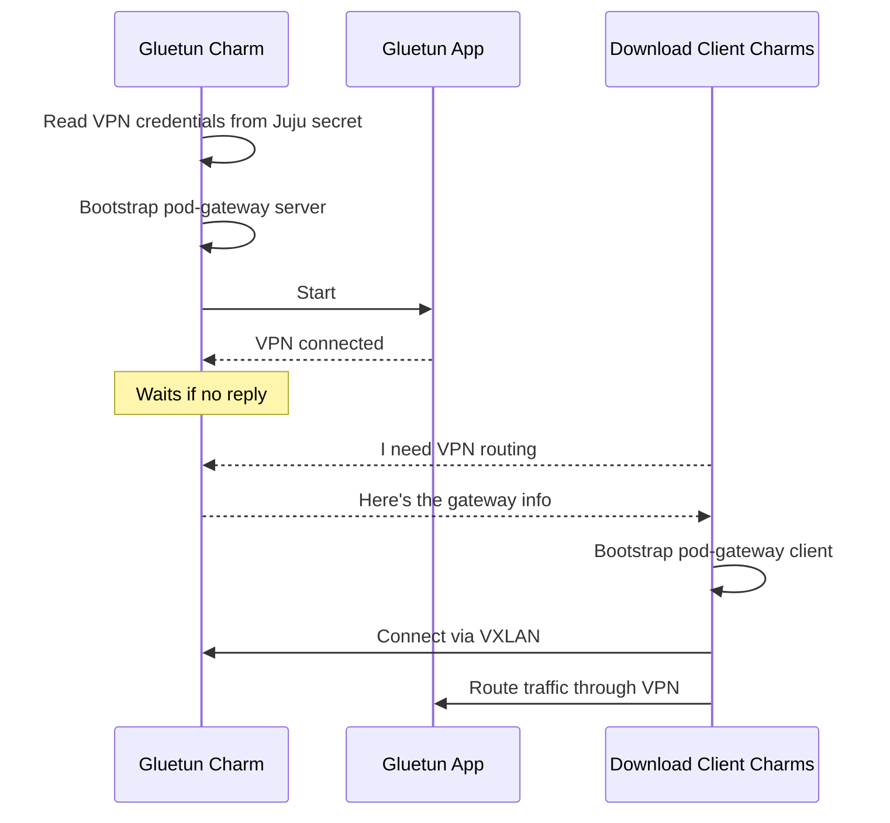

# VPN Gateway

## Gluetun

The Gluetun charm (`gluetun-k8s`) manages the VPN gateway in your Charmarr stack. Gluetun is a VPN client that routes traffic from download clients through a VPN tunnel to protect your privacy.

### Relations

The charm talks to other charms to figure out how to set everything up. The order in which these connections happen doesn't matter. The charm sorts it out.

| Connects To | What It Provides |
|-------------|------------------|
| **qBittorrent/SABnzbd/Prowlarr** | VPN tunnel routing for their traffic |

When download clients connect, the charm automatically configures them to route all external traffic through the VPN. If the VPN connection drops, traffic is blocked (killswitch).

### How It Works

Without a VPN gateway, download clients connect directly to the internet and your home IP is exposed to torrent trackers and usenet providers. The Gluetun charm fixes this by doing two things when it starts:

1. Establishes a WireGuard VPN tunnel
2. Bootstraps a [pod-gateway](https://github.com/angelnu/pod-gateway) server (init container + sidecar) onto itself

When a download client charm connects to Gluetun, it bootstraps a pod-gateway client (init container + sidecar) onto itself. The client and server form a VXLAN overlay network. A single Gluetun pod serves multiple download clients.

A two-way killswitch protects your privacy:

1. **NetworkPolicy**: Kubernetes blocks traffic if the Gluetun pod dies
2. **Gluetun's internal firewall**: Blocks traffic if the VPN connection drops

This means:

- A single VPN connection serves all download clients
- Download clients don't need individual VPN configurations
- Your real IP is never exposed to torrent trackers or usenet providers in a resilient and reliable way

### Lifecycle

### Configuration

The charm requires:

- **VPN provider** (e.g., mullvad, protonvpn, custom)
- **WireGuard private key** stored as a Juju secret
- **Cluster CIDRs** so internal traffic bypasses the VPN

See [gluetun-k8s on Charmhub](https://charmhub.io/gluetun-k8s) for all options.
