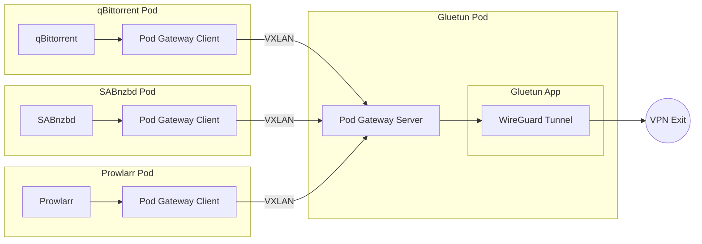
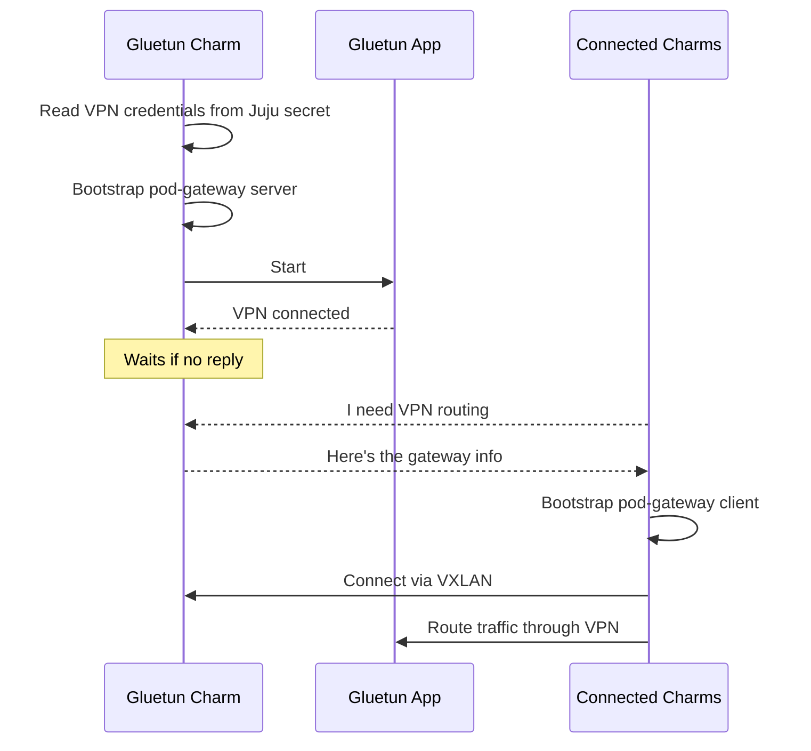

# VPN Gateway

## Gluetun

The Gluetun charm (`gluetun-k8s`) manages the VPN gateway in your Charmarr stack. Gluetun routes traffic from connected charms through a VPN tunnel to protect your privacy.

### Relations

The charm talks to other charms to figure out how to set everything up. The order in which these connections happen doesn't matter. The charm sorts it out.

| Connects To | What It Provides |
|-------------|------------------|
| **qBittorrent/SABnzbd/Prowlarr** | VPN tunnel routing for their traffic |

When charms connect, Gluetun automatically configures them to route all external traffic through the VPN. If the VPN connection drops, traffic is blocked (killswitch).

### How It Works

Without a VPN gateway, charms connect directly to the internet and your home IP is exposed to torrent trackers, indexers, and usenet providers. The Gluetun charm fixes this by doing two things when it starts:

1. Establishes a WireGuard VPN tunnel
2. Bootstraps a [pod-gateway](https://github.com/angelnu/pod-gateway) server (init container + sidecar) onto its pod

When a charm connects to Gluetun, the Gluetun charm provides gateway info. The connecting charm uses this info to bootstrap a pod-gateway client (init container + sidecar) onto its pod. The pod-gateway client connects to the pod-gateway server using this gateway info to form a VXLAN overlay network. A single Gluetun pod serves multiple charms.

<center>



</center>

A two-way killswitch protects your privacy:

1. **NetworkPolicy**: Kubernetes blocks traffic if the Gluetun pod dies
2. **Gluetun's internal firewall**: Blocks traffic if the VPN connection drops

See [Networking](../security/network.md) for technical details on how the killswitch works.

This means:

- A single VPN connection serves all connected charms
- Charms don't need individual VPN configurations
- Your real IP is never exposed to torrent trackers, indexers, or usenet providers in a resilient and reliable way

The Gluetun charm enables bootstrapping this fairly advanced networking layer with a simple intuitive command:

```bash
juju integrate gluetun sabnzbd
```

### Lifecycle



### Configuration

The charm requires:

- **VPN provider** (e.g., mullvad, protonvpn, custom)
- **WireGuard private key** stored as a Juju secret
- **Cluster CIDRs** so internal traffic bypasses the VPN

See [gluetun-k8s on Charmhub](https://charmhub.io/gluetun-k8s) for all options.
