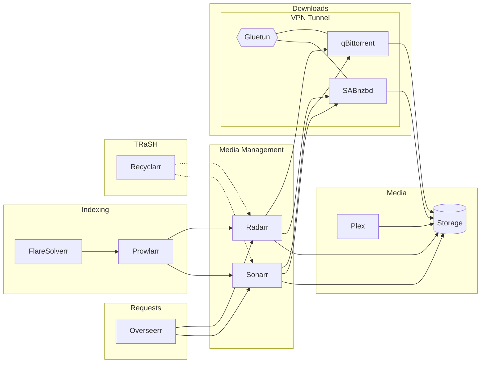

<h1 class="landing-title">Your media stack, on autopilot.</h1>

Self-hosted [Servarr](https://wiki.servarr.com) and friends automatically configured, connected, secured. One command to rule them all.



## K8s is a time-sink for homelabs?

Sure, Kubernetes has self-healing, scaling, and infrastructure-as-code. But it also wants you to solve VPN routing that doesn't leak, shared storage with hardlinks, and cross-app configuration that survives pod restarts. Copy a million manifests and set up a gitops workflow to have a declarative deployment. Who has time to do all that for a self-hosted home media stack?

## Charmarr says hold my beer

Charmarr is an open-source collection of [Juju charms](https://juju.is) wrapping your favorite arr apps. It deploys and manages your media stack on Kubernetes while handling the hard parts: VPN routing, storage reconciliation, credential rotation, service discovery, cross-app configuration. And throws in bleeding edge network security for free.

It aims to provide a simple accessible-to-any-homelabber UX, even simpler than setting up docker compose, for bootstrapping an enterprise grade system. All of this within a few minutes that you won't even be able to prepare popcorn before it's done.

Really. The deployment looks like this:

1. Write a 20-line config

    ```hcl
    variable "wireguard_private_key" {
      description = "WireGuard private key from your VPN provider"
      type        = string
      sensitive   = true
    }

    module "charmarr" {
      source = "git::https://github.com/charmarr/charmarr//terraform/charmarr?ref=main"

      model                 = "charmarr"
      wireguard_private_key = var.wireguard_private_key
      vpn_provider          = "protonvpn"
      cluster_cidrs         = "10.1.0.0/16,10.152.183.0/24,192.168.0.0/24"
      storage_backend       = "hostpath"
      hostpath              = "/my/gazillion/tb/storage"
      storage_size          = "10000000000000Ti"
    }
    ```

2. And just run a one-liner:

    ```bash
    tofu init && TF_VAR_wireguard_private_key="key" tofu apply -auto-approve
    ```

And you're done. Charmarr begins autonomously wiring up the apps for you.

<div id="demo"></div>
<link rel="stylesheet" href="https://cdn.jsdelivr.net/npm/asciinema-player@3.10.0/dist/bundle/asciinema-player.min.css">
<script src="https://cdn.jsdelivr.net/npm/asciinema-player@3.10.0/dist/bundle/asciinema-player.min.js"></script>
<script>AsciinemaPlayer.create('assets/demo.cast', document.getElementById('demo'), {speed: 3, theme: 'dracula', autoPlay: true, loop: true, fit: 'width'});</script>

## Life after

<div class="grid cards feature-cards" markdown>

-   :material-key-remove: **No more copy-paste API keys**

    ---

    Apps find each other and configure themselves through [relations](https://documentation.ubuntu.com/juju/3.6/reference/relation/). No more manual copy-pasting of API keys or URLs. Charmarr butlers it all for you.

-   :material-star-shooting: **TRaSH Guides, built-in**

    ---

    Built-in clean TRaSH guide profiles using Recyclarr. Easy customization. Just run `juju config radarr trash-profile=remux-web-1080p`.

-   :material-incognito: **Privacy first setup**

    ---

    Public traffic stays anonymized always via Gluetun. And protected with a double layered kill switch. Meaning no leaks, ever.

-   :material-shield-lock: **Zero-trust ready**

    ---

    Enable Istio Ambient for mTLS and authz firewalls between services, auto-configured from charm relations. Enterprise security, one flag away.

-   :material-heart-pulse: **It fixes itself**

    ---

    Pod dies? Charmarr reconciles. You sleep. Config drift? Charmarr heals. You chill.

-   :material-key-change: **Keys rotate themselves**

    ---

    API keys are encrypted at rest. Charmarr rotates them regularly and auto-configures the stack. You can't leak what you don't know.

</div>

<div class="cta-center" markdown>
[Set up Charmarr in your lab :material-arrow-right:](setup/index.md){ .md-button .md-button--primary }
</div>

<div class="powered-by">
<div class="powered-by-label">Powered by</div>
<div class="powered-by-row">
  <a href="https://prowlarr.com"></a>
  <a href="https://radarr.video"></a>
  <a href="https://sonarr.tv"></a>
  <a href="https://www.qbittorrent.org"></a>
  <a href="https://sabnzbd.org"></a>
  <a href="https://www.plex.tv"></a>
  <a href="https://overseerr.dev"></a>
  <a href="https://github.com/FlareSolverr/FlareSolverr"></a>
  <a href="https://recyclarr.dev"></a>
  <a href="https://trash-guides.info"></a>
</div>
<div class="powered-by-row">
  <a href="https://github.com/qdm12/gluetun"></a>
  <a href="https://www.linuxserver.io"></a>
  <a href="https://kubernetes.io"></a>
  <a href="https://juju.is"></a>
  <a href="https://istio.io"></a>
  <a href="https://opentofu.org"></a>
</div>
</div>
