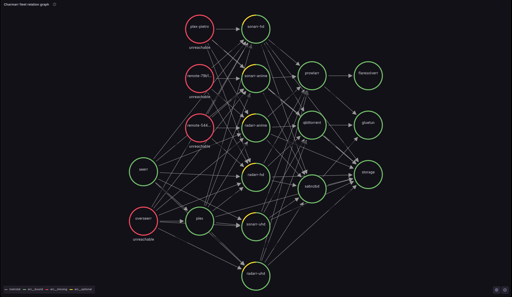
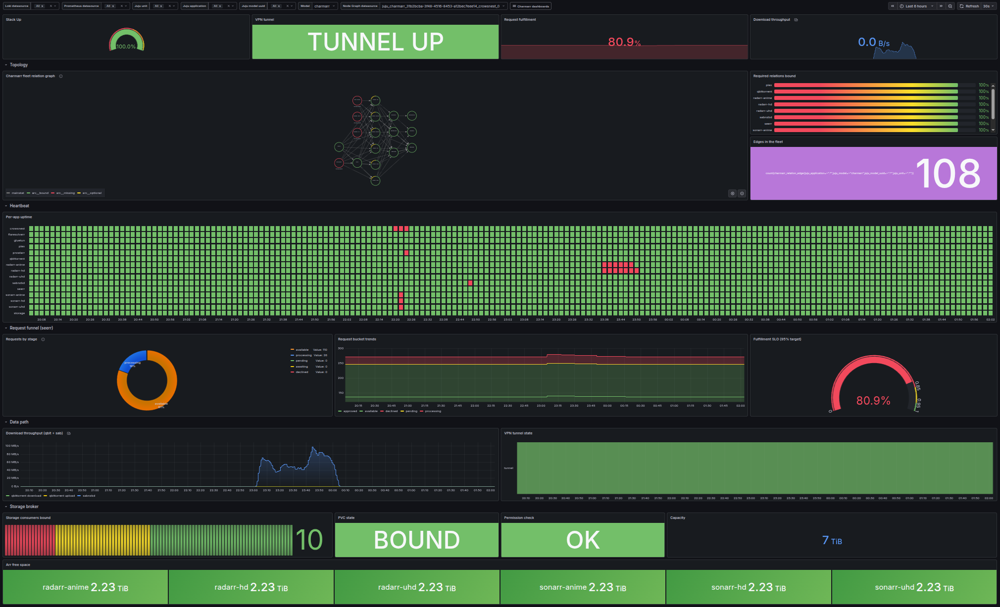

# Crowsnest Experimental

Charmarr ships per-charm dashboards for free. But operating a fleet of charms means caring about *cross-cutting* signal too. Is every required relation wired? Is the request pipeline backed up? Is the VPN tunnel healthy *while* the download clients have downloads in flight? Is the storage broker losing consumers?

That's what crowsnest answers.

Crowsnest is a workloadless charm. It has no upstream application to babysit. Its only job is to sit above the fleet and watch, which is, of course, the whole point of a [crowsnest](https://en.wikipedia.org/wiki/Crow%27s_nest). Three concrete things come out of that.

## Fleet topology graph

Crowsnest polls every fleet member's topology endpoint and aggregates them into a single relation graph. The graph is rendered in Grafana by the [`hamedkarbasi93-nodegraphapi-datasource`](https://grafana.com/grafana/plugins/hamedkarbasi93-nodegraphapi-datasource/) plugin.

Each node is one charm. The arcs around the node tell you the health of that charm's relations.

* **Green** for relations that are wired and bound.
* **Red** for required relations declared but unbound. This is breakage.
* **Yellow** for optional relations declared but unbound. Informational.

Click a node and a popover lists exactly which required and optional relations are missing. Edges are labeled with the relation interface. Hover over an edge to see which two apps are connected.

Glance at the graph and you immediately see what's missing. Sonarr without a download client. Storage with no consumers. Prowlarr isolated. The kind of breakage that vanilla per-charm dashboards never surface because it's a cross-charm concern.

## Any charm can extend the fleet view

Every charmarr charm runs a small topology process in its charm container that publishes the standard topology metrics. The process accepts a callback hook: any charm can hand it a small piece of code that emits additional metrics scoped to that charm's domain, with no new exporter, no new port, and no extra wiring.

Crowsnest aggregates whatever each charm chooses to expose. A few of the metrics already shipped this way:

* Seerr emits live counts of requests per status. The fleet request funnel and the fulfillment SLO are powered entirely by this.
* Radarr, sonarr, and sabnzbd emit one series per item currently in their download queue. The active-downloads tables read straight from these.
* Qbittorrent and sabnzbd emit an `unsafe-mode` flag. Crowsnest combines it with the VPN relation state to alert if any download client is configured to bypass the VPN.

The hook exists for signal the standard exporters cannot provide. Charmarr treats robust community exporters as first-class and prefers them by default, so the customisation surface stays small. A charm is meant to model the workload, not to host arbitrary scraping logic.

## Fleet dashboard

Beyond the graph, crowsnest ships a fleet-wide Grafana dashboard with cross-cutting panels that aggregate signal from every member of the stack.

The top of the dashboard answers "is the stack healthy right now". A reachability gauge summarizes how many apps in the fleet are up. A statuspage-style heartbeat strip gives one uptime row per app.

The middle of the dashboard answers "what's the user experience like". The request funnel visualizes pending, awaiting, processing, available, and declined requests as mutually exclusive stages, powered by the metric seerr publishes. A fulfillment SLO gauge compares delivered against approved over the configured target.

The bottom of the dashboard answers "where are the operationally-critical states". Storage free space per arr unit. VPN tunnel state with rolling history. Active downloads from qbittorrent and sabnzbd. Recent error and warning lines from every workload.

Finally a per-charm dashboard dropdown lives in the header so you can pivot from the fleet view straight into the individual app dashboard while keeping the time range.

## SLO catalog

:material-progress-wrench:

The SLO documentation is being actively iterated on. Coverage will land alongside the next round of refinements.

Crowsnest publishes a curated [Sloth](https://sloth.dev) catalog over the `sloth` interface. Integrate it with the [`sloth-k8s` charm](https://github.com/canonical/sloth-k8s-operator) and Sloth generates the Prometheus recording rules and multi-burn-rate alerts automatically. The current catalog covers request fulfillment, storage health, and stack availability, calibrated for homelab-scale objectives.

## Wiring

Crowsnest is deployed and integrated automatically by the [Terraform path](enable.md#with-terraform) when the `cos` variable is set. The manual flow is covered under [the Juju CLI walkthrough](enable.md#with-the-juju-cli).
