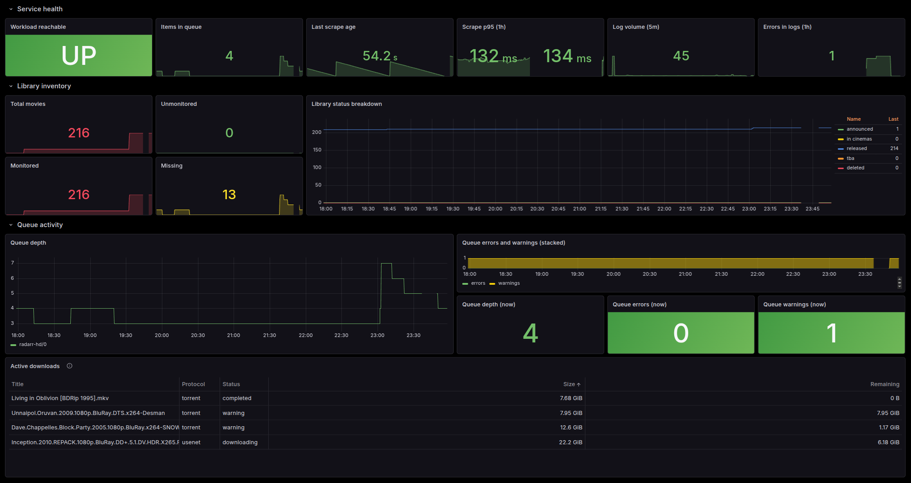
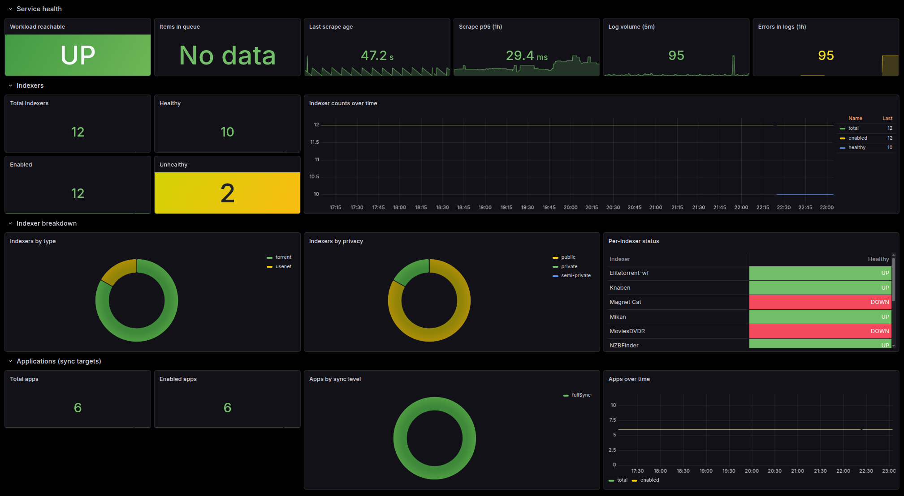
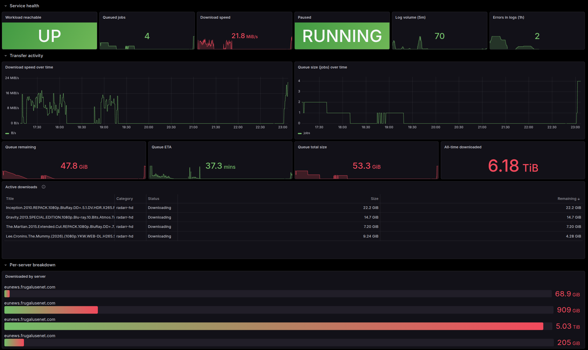

# Dashboards

Every charm that exposes a `grafana-dashboard` relation ships with a curated Grafana dashboard baked into the charm. Integrate the charm with Grafana once and the dashboard is auto-imported. No JSON to download. No imports to manage. No drift between source and rendered.

Every dashboard is tagged `charmarr` and an app-specific tag (such as `radarr` or `sonarr`) so they're easy to find in the Grafana dashboards list.

## What a per-charm dashboard covers

A typical dashboard has four sections.

**Service health** is the top row. Single-glance stats for workload reachability, queued items, last scrape age, scrape latency, log volume, and recent error rate. If something is wrong, this is where it shows up first.

**Workload signal** is the middle. The signal that matters for that specific app. Library state for the arrs. Active downloads for the download clients. VPN tunnel state and public IP geolocation for gluetun.

**Storage** is below. Free bytes per root folder, used percentage of the underlying filesystem, and a capacity stat.

**Logs** is the bottom row. An embedded Loki query for the recent error and warning lines, scoped to the unit.

## Examples

=== "Radarr"

    

    The library section shows how many movies are monitored versus unmonitored, what's missing, and a quality breakdown. The queue section surfaces stuck items, indexer errors, and warnings that need attention.

    The standout panel is **Active downloads**, populated live from radarr's `/api/v3/queue`. Every in-flight movie shows up with its title, status, protocol, total size, and bytes remaining. Sorted so the biggest pending downloads float to the top.

=== "Prowlarr"

    

    Indexer health is the centerpiece. The dashboard tells you which indexers are up, which are down, and how each is performing in terms of query throughput.

    For private trackers a **VIP expiration tracker** counts down the days until each paid subscription expires. Color-graded green to red so it's hard to miss a renewal.

=== "SABnzbd"

    

    The transfer section trends download speed and queue depth over time. The per-server breakdown shows which provider is doing the work and which is idle.

    The **Active downloads** table is again the centerpiece, populated from sabnzbd's queue API. Title, status, category, size, and bytes remaining per NZB. The same shape as the radarr table, different source.

Similar dashboards ship for sonarr, qbittorrent, plex, gluetun, flaresolverr, and charmarr-storage.

## How they get there

When you integrate `<charm>:grafana-dashboard` with the COS Grafana, the charm publishes the dashboard JSON over the relation. Grafana imports it under the `charmarr` folder. Subsequent charm refreshes that update the dashboard JSON automatically refresh Grafana's stored copy on the next reconcile.

!!! tip "Bump the version on edits"
    If you fork a dashboard and modify it for your deployment, remember to bump the top-level `"version"` field in the JSON. Grafana keys reloads off this field and silently ignores updates with the same version.
