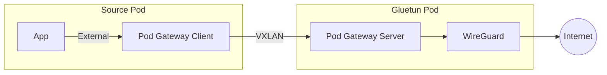
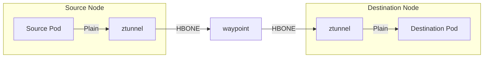
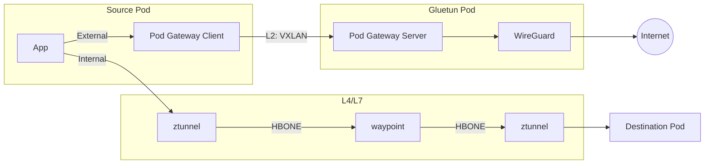

# Networking

Charmarr secures network traffic at multiple [OSI layers](https://en.wikipedia.org/wiki/OSI_model). Each layer addresses a different concern, and together they provide defense in depth.

| Layer | Technology | Purpose |
|-------|------------|---------|
| **L2** | VXLAN overlay | External traffic anonymization through VPN |
| **L4** | Istio ztunnel | Internal encrypted transport, L4 authorization |
| **L7** | Istio waypoint | Internal application-layer authorization |

## L2: VXLAN Overlay

Privacy-sensitive charms (qBittorrent, SABnzbd, Prowlarr) must not expose your home IP to external services. Charmarr solves this with a VXLAN overlay network that tunnels external traffic through a VPN.

Each privacy-sensitive pod runs a pod-gateway client. This client establishes a VXLAN tunnel to a pod-gateway server running on the Gluetun pod. All external traffic from the pod routes through this tunnel, into the Gluetun pod, and out through a WireGuard VPN connection.

<center>



</center>

The VXLAN overlay only captures traffic destined for external networks. Intra-cluster traffic bypasses the overlay entirely and flows through the higher layers (L4/L7) unaffected. This is configured via cluster CIDRs that tell the pod-gateway client which destinations are internal.

A two-way killswitch protects against VPN failures:

1. **Gluetun firewall**: Blocks traffic if the WireGuard connection drops
2. **NetworkPolicy**: Kubernetes blocks traffic if the Gluetun pod dies

Here's an example NetworkPolicy that Charmarr creates for SABnzbd:

```yaml
apiVersion: networking.k8s.io/v1
kind: NetworkPolicy
metadata:
  name: sabnzbd-k8s-vpn-killswitch
  namespace: charmarr
spec:
  podSelector:
    matchLabels:
      app.kubernetes.io/name: sabnzbd-k8s
  policyTypes:
  - Egress
  egress:
  - to:
    - ipBlock:
        cidr: 10.1.0.0/16       # Pod CIDR
  - to:
    - ipBlock:
        cidr: 10.152.183.0/24   # Service CIDR
  - to:
    - ipBlock:
        cidr: 192.168.0.0/24    # LAN CIDR
  - to:
    - ipBlock:
        cidr: 169.254.7.127/32  # Pod-gateway server IP
  - ports:
    - port: 53
      protocol: UDP
    - port: 53
      protocol: TCP
    to:
    - namespaceSelector:
        matchLabels:
          kubernetes.io/metadata.name: kube-system
```

This policy only allows SABnzbd to send traffic to:

- **Cluster CIDRs** (pod, service, LAN): Internal traffic that bypasses the VPN
- **Pod-gateway server IP**: The entry point into the VXLAN tunnel on the Gluetun pod
- **kube-system DNS**: Required for name resolution

All other egress is blocked. If the Gluetun pod dies, the pod-gateway server becomes unreachable and SABnzbd cannot reach the internet.

See [VPN Gateway](../charms/vpn-gateway.md) for more details.

## L4/L7: Service Mesh

East-west traffic (intra-cluster) flows through [Istio ambient mesh](https://istio.io/latest/docs/ambient/overview/). Unlike the VXLAN layer which anonymizes north-south traffic (external), the service mesh encrypts and authorizes internal pod-to-pod communication.

Charmarr uses the [Charmed Istio](https://canonical-service-mesh-documentation.readthedocs-hosted.com/en/latest/) distribution. The charmed service mesh automatically enrolls Charmarr pods into the mesh and configures authorization policies based on charm topology and policies defined in charm code.

### How Traffic Flows

When a pod sends traffic to another pod (source and destination may be on the same node):

<center>



</center>

**Step 1: Source ztunnel (L4 firewall outlet)**

Traffic leaving a pod is redirected to the node's ztunnel. The ztunnel encrypts the traffic using the [HBONE protocol](https://istio.io/latest/docs/ambient/architecture/hbone/), which provides mTLS without the complexity of manually managing certificates. The ztunnel then forwards the encrypted traffic toward the destination.

**Step 2: Waypoint (L7 firewall inlet)**

The encrypted traffic arrives at the waypoint proxy. The waypoint understands HBONE and inspects the request at L7. It evaluates authorization policies (firewall rules) and only forwards traffic that matches an explicit allow rule. Traffic without a matching policy is dropped.

**Step 3: Destination ztunnel (L4 firewall inlet)**

The waypoint forwards allowed traffic to the destination node's ztunnel. This ztunnel validates the traffic against its own L4 authorization policies. Traffic without a matching allow policy is dropped.

**Step 4: Delivery**

The destination ztunnel terminates the HBONE encryption and delivers the traffic to the destination pod as plaintext.

### Authorization Policies

The charmed service mesh automatically creates authorization rules based on the system topology and policy targets specified by charms. Unrelated pods cannot communicate.

This limits lateral movement if a pod is compromised. An attacker cannot reach pods that the compromised pod has no legitimate reason to contact.

## The Full Picture

Charmarr's network security was designed so that each layer provides protection without interfering with the others. L2 handles external traffic anonymization while L4/L7 secures internal communication. They operate independently, in harmony.

External and internal traffic take different paths from the same source:

<center>



</center>