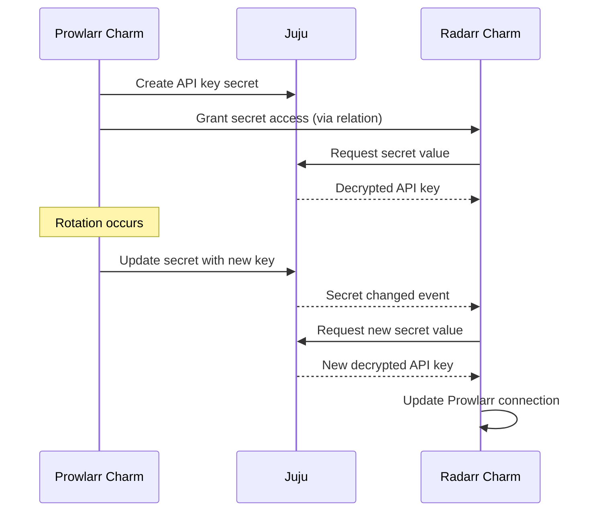

# Secrets

Charmarr uses Juju secrets to manage sensitive data like API keys and VPN credentials. Secrets are encrypted at rest, rotated automatically, and synced across related charms.

## Encrypted at Rest

Juju stores secrets encrypted in its database. Applications never see the encryption key. When a charm needs a secret value, it requests it from Juju, which decrypts and delivers it securely.

This means:

- Secrets are not stored in plain text ConfigMaps or environment variables
- Database backups contain encrypted secrets
- Only authorized charms can access secrets they own or are granted

## Automatic Rotation

Charms that generate API keys or credentials (Radarr, Sonarr, Prowlarr, SABnzbd, qBittorrent) can rotate them periodically. When rotation occurs:

1. The charm generates a new API key
2. The charm updates the Juju secret with the new value
3. Related charms receive the updated secret automatically

This limits the impact of a leaked credential. Even if an API key is exposed, it becomes invalid after the next rotation.

## Cross-App Sync

When charms form relations, they can grant each other access to secrets. For example:

- Prowlarr grants Radarr access to its API key
- Radarr uses this to register itself with Prowlarr
- If Prowlarr rotates its API key, Radarr automatically receives the new value

This automation means:

- No manual secret distribution
- No stale credentials after rotation
- No downtime during key changes

## What Charmarr Protects

| Secret Type | Managed By | Rotates |
|-------------|------------|---------|
| API keys | Radarr, Sonarr, Prowlarr, SABnzbd | Yes (configurable) |
| Credentials | qBittorrent | Yes (configurable) |
| VPN credentials | Gluetun | No (user-provided) |
| Plex claim token | Plex | No (one-time use) |

VPN credentials and Plex tokens are user-provided and stored as Juju secrets but not rotated by Charmarr. API keys and credentials are generated and rotated by the charms themselves.
