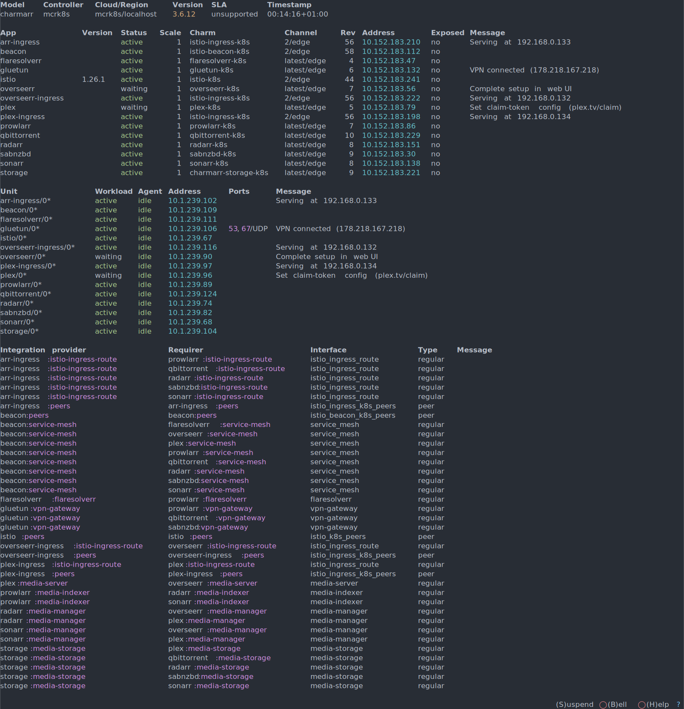
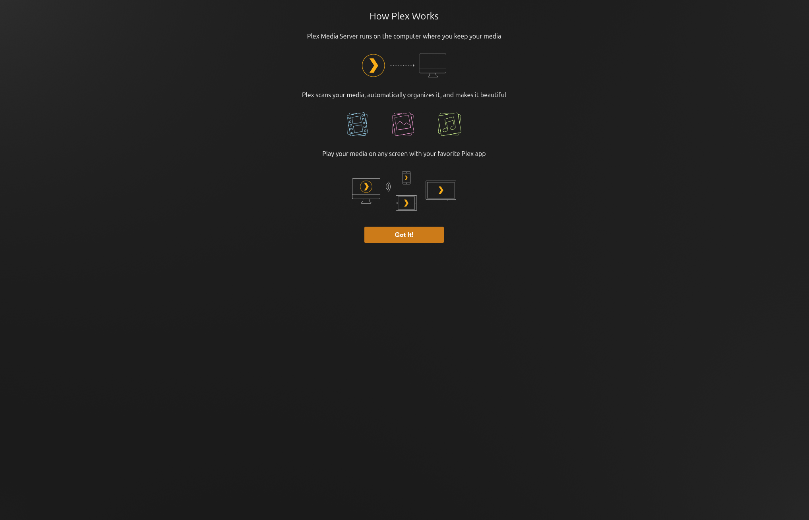
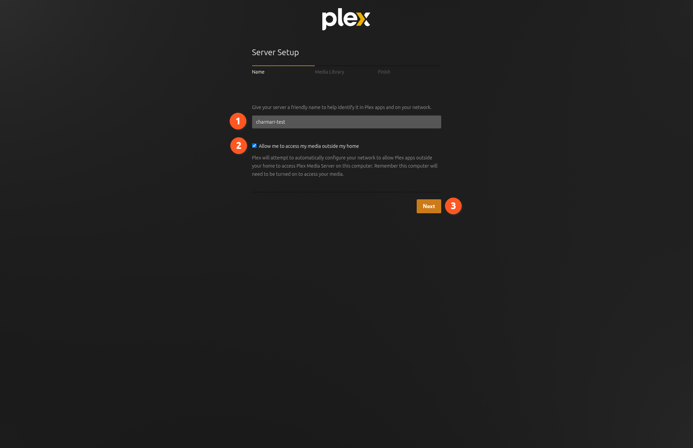
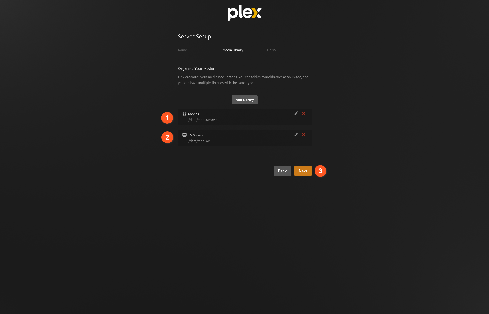
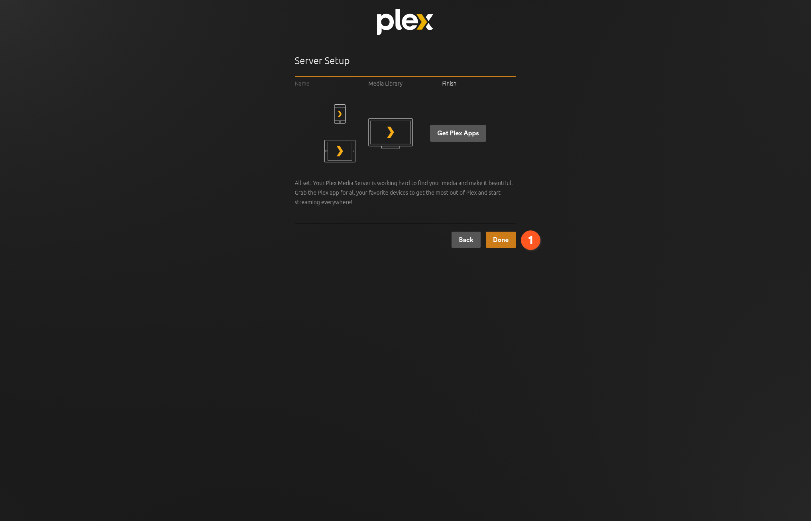
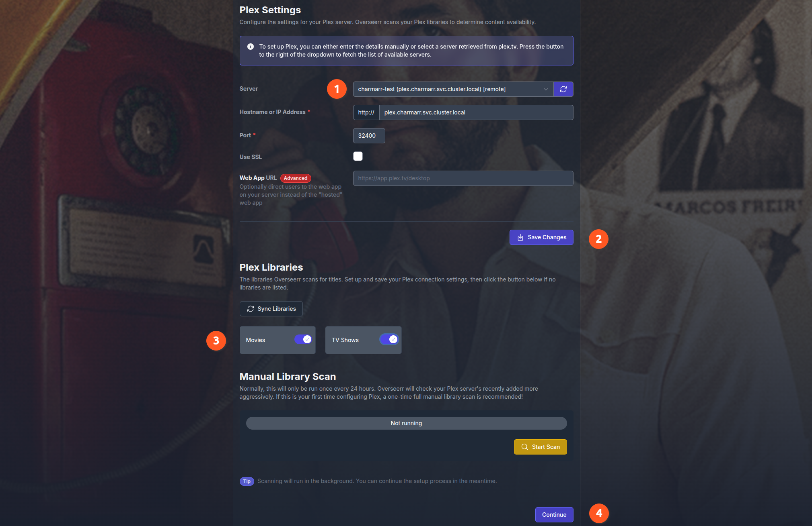
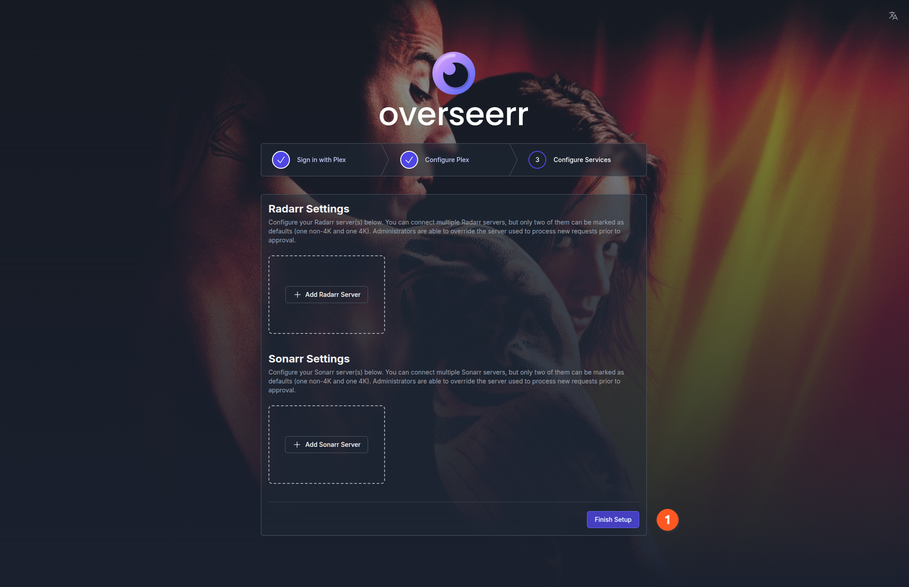
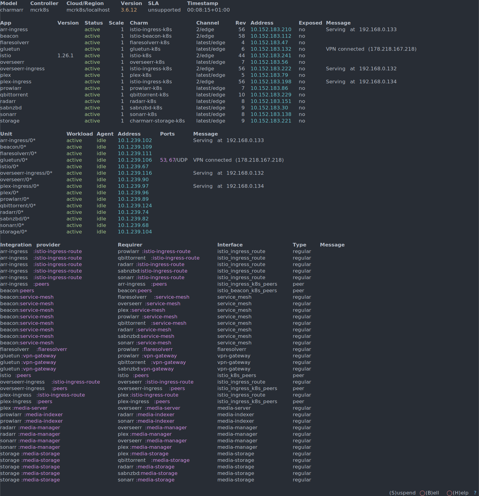

# Post-Deploy

Charmarr handles the backend wiring for all the cross-application configurations, but Plex and Overseerr need one-time web UI user setup.

## Watch the Deployment

Open a terminal and run:

```bash
juju status --integrations --watch 1s
```

!!! tip
    Keep this terminal open throughout the setup. It's the best way to monitor what's happening.

Watch Charmarr deploy and wire the applications together. Once settled, you should see something like this:



Plex and Overseerr are in `waiting` status, waiting for user action. Everything else should be `active`.

---

## 1. Plex Setup

### Get Claim Token

1. Go to [plex.tv/claim](https://plex.tv/claim)
2. Copy the claim token

!!! note
    The claim token is stored as plain text, but that's fine because it's only valid for 4 minutes.

### Set Claim Token

```bash
juju config plex claim-token="claim-XXXXXXXXXXXXXXXXXXXX"
```

Plex should transition to `active` status.

!!! warning
    Wait 5-10 minutes before proceeding. Plex needs time to register the new server and propagate changes. If you're too fast, the server might not be registered yet.

### Open Plex UI

Get the Plex ingress IP from the `plex-ingress` message in `juju status`:

```
plex-ingress/0*    active    idle    10.1.239.97    Serving at 192.168.0.134
```

Open in browser:

```
http://192.168.0.134:443
```

!!! note
    Yes, `http` with port `443`. There is a method behind this madness. This is intentional for future Tailscale integration. And not configurable at this time.

### Complete Plex Setup

**Step 1:** Once the server is registered, you should see the welcome screen. Click **Got It!**



**Step 2:** Enter a name for your server. Enable remote play if you want (2). Click **Next**. If you get a Plex Pass popup, you can safely close it.



**Step 3:** Movie and TV libraries are already pre-configured by Charmarr (1, 2). The number of libraries here depends on your Radarr(s) and Sonarr(s). Click **Next**.



<small>Curious how? See [Plex Charm Lifecycle](../charms/media-server.md#lifecycle).</small>

**Step 4:** Click **Done**.



!!! warning
    Plex might not auto-scan libraries by default. See the [Plex docs on library scanning](https://support.plex.tv/articles/200289306-scanning-vs-refreshing-a-library/) to enable automatic refresh.

---

## 2. Overseerr Setup

### Open Overseerr UI

Get the Overseerr ingress IP from the `overseerr-ingress` message in `juju status`:

```
overseerr-ingress/0*    active    idle    10.1.239.116    Serving at 192.168.0.132
```

Open in browser:

```
http://192.168.0.132:443
```

### Complete Overseerr Setup

**Step 1:** Click **Sign In**. Overseerr uses Plex SSO.


**Step 2:** After signing in:

1. Click the **Retrieve** icon (1) to load your Plex servers
2. Select the server name you set during Plex setup
3. Click **Save Changes**



!!! tip
    If **Save Changes** is greyed out, toggle the **Use SSL** checkbox on and off again to enable it.

!!! warning
    Leave **Hostname or IP Address**, **Port**, and **Use SSL** options at their default values.

Once saved, Overseerr loads your Plex libraries (3). Enable sync for all libraries by clicking the toggles. Click **Continue**.

**Step 3:** Radarr and Sonarr settings may or may not be pre-filled, but it doesn't matter at this point. Do not add anything manually. Click **Finish Setup**.



---

## 3. Verify Everything

Wait 5 minutes, then check `juju status`. All apps should be `active`:



In Overseerr UI, go to:

<div class="nav-flow" markdown>
**Settings** :material-arrow-right: **Services**
</div>

Radarr(s) and Sonarr(s) should automatically appear. Charmarr added them for you.

<small>Curious how? See [Overseerr Charm Lifecycle](../charms/media-requester.md#lifecycle).</small>

---

## 4. Add Indexers

Get the arr ingress IP from `juju status` and open Prowlarr:

```
http://ARR_INGRESS_IP:443/prowlarr
```

Add your indexers. The more the merrier.

### Usenet Setup (Optional)

If using usenet indexers, configure SABnzbd:

```
http://ARR_INGRESS_IP:443/sabnzbd
```

Add a usenet server like [Frugal Usenet](https://frugalusenet.com/) or [Eweka](https://www.eweka.nl/).

### qBittorrent Access (Optional)

There's no mandatory need to access qBittorrent, but if you want to customize settings:

```
http://ARR_INGRESS_IP:443/qbittorrent
```

Credentials are pre-configured by Charmarr. To retrieve them:

```bash
# List all secrets
juju secrets
# ID                    Name     Owner         Rotation  Revision  Last updated
# d5lvqs7mp25c7ffo3tv0  -        qbittorrent   monthly          1  8 hours ago

# Reveal the qbittorrent credentials (use the ID from above)
juju show-secret --reveal d5lvqs7mp25c7ffo3tv0
```

!!! note
    Charmarr rotates credentials periodically. If login fails, grab the latest credentials using the commands above.

!!! warning
    The default account is Charmarr's account used for automation. Do not remove or change it.

---

## Done

Charmarr will continue to monitor, reconcile, and heal your stack.

Request a movie in Overseerr, go prepare popcorn and grab a beer, come back and open Plex. Your movie should be ready. Mileage may vary based on internet speeds - you might even have time to prepare dinner.

!!! note
    This page covers Charmarr-specific configurations only. For general app configurations, which are not necessary for Charmarr as it does all the configurations for you, refer to each app's own documentation.

---

<div style="display: flex; justify-content: space-between" markdown>
<div markdown>
[:octicons-arrow-left-24: Quick Deploy](quickdeploy.md)
</div>
<div markdown>
</div>
</div>
